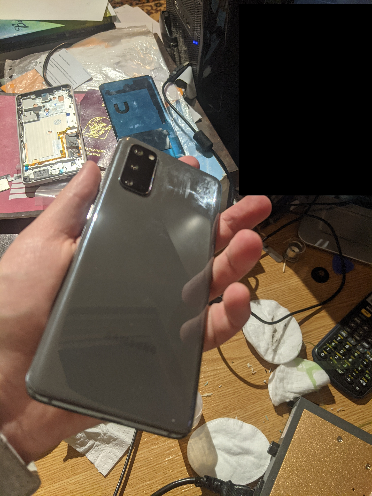
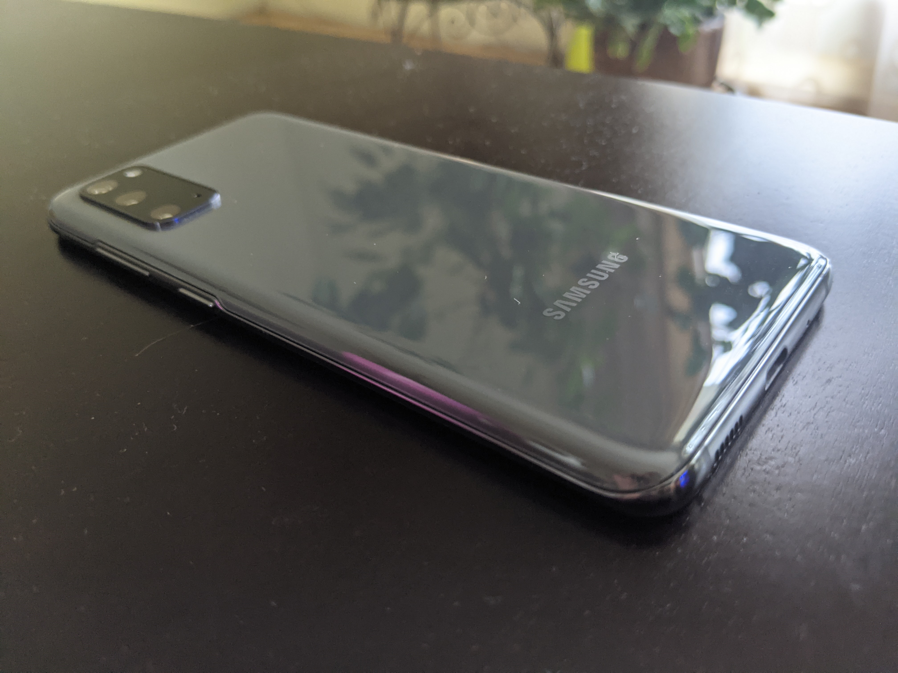
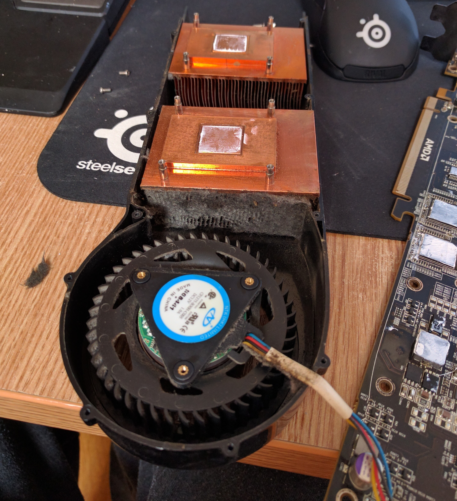
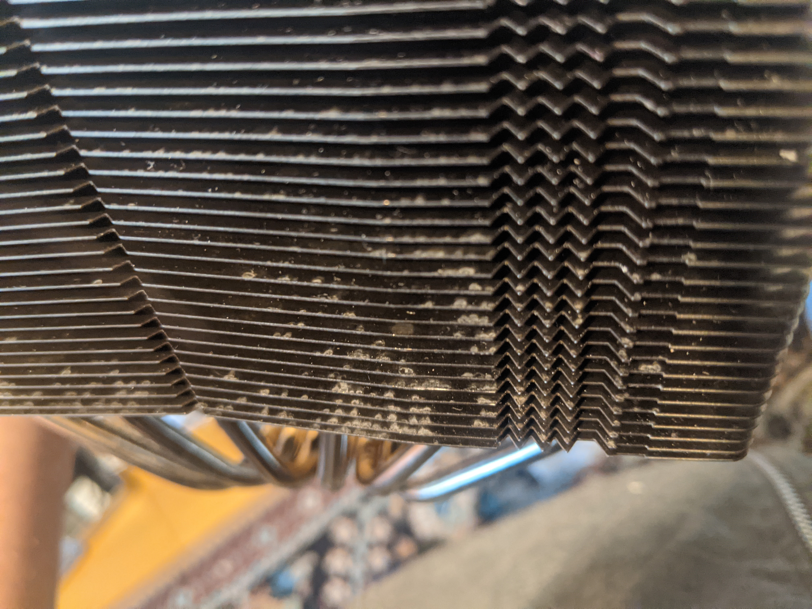
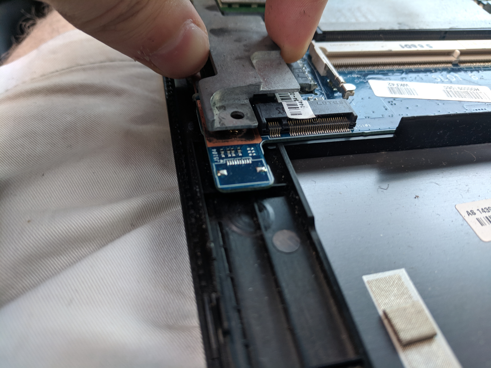
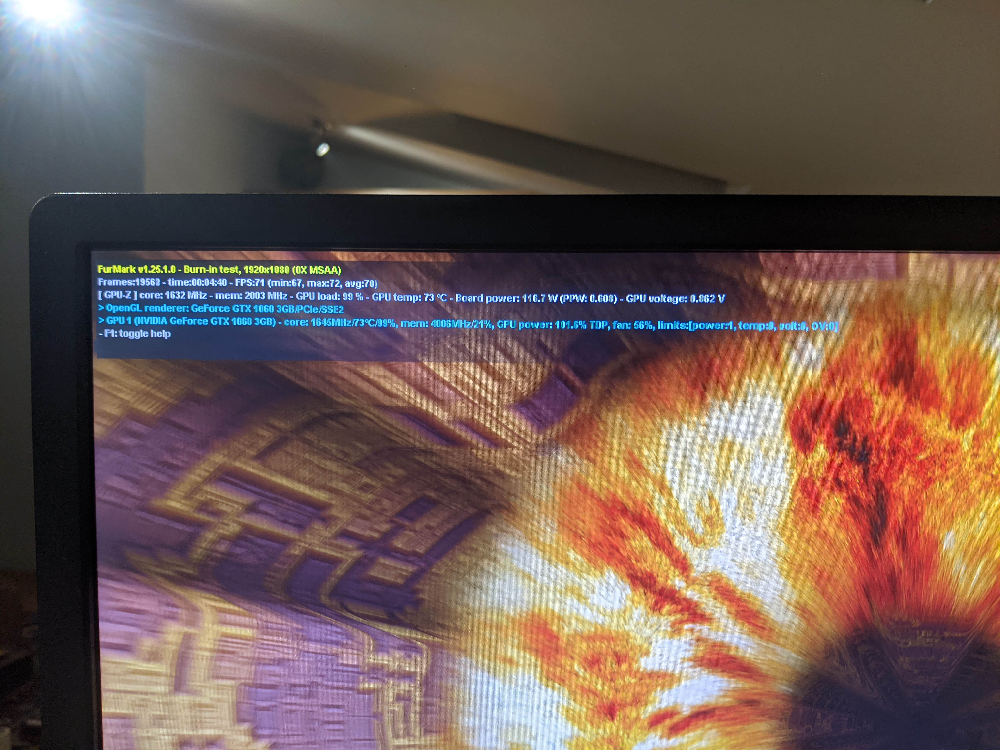
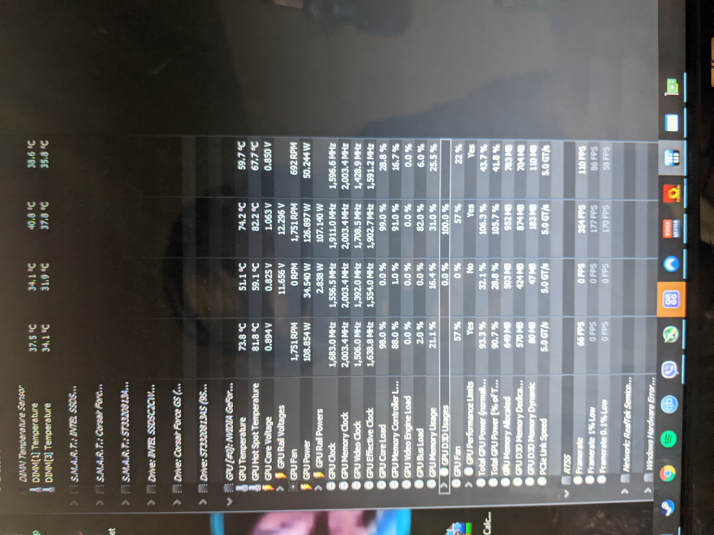

# Projects

## Disclaimer:

These images showcase a collection of projects and activities I've undertaken over the past few years. Due to the volume of images, I recommend scrolling through them quickly to save time. While I'll provide explanations for some of the pictures, I may not cover them all. However, if you have any questions, please don't hesitate to ask—I'm more than happy to provide detailed explanations for each image. Additionally, if desired, I can provide more pictures beyond the ones uploaded, since this is just a small part of the collection of images that I have.

:warning: Unfortunately, I'm unable to provide screenshots of conversations with clients, manufacturers, sellers, etc., out of respect for privacy and confidentiality. I hope for your understanding in this matter. The same applies to any projects or work containing sensitive information.

:warning: These pictures were originally intended for my personal use only. Some were taken for reference or to share with friends, and I never anticipated using them as proof of my work. If I had known, I would have taken more or better pictures specifically for demonstration purposes. Unfortunately, these images are the only proof I have in many cases, which is why I'm sharing them now.

:warning: You will probably notice that some images have black bars edited in. This was done to conceal private or sensitive content and ensure privacy.

:warning: I kindly request that you respect my privacy. These pictures are intended for viewing by individuals directly involved in the hiring process. Therefore, I ask that they not be downloaded, shared, or distributed in any way. After the hiring process is complete, this repository will be made private, and the link will no longer be accessible.

---
## PC, Hardware, repair, testing, electronics and other stuff

### Some of the things I did the past month:

*Display broken after a drop, this display was already replaced with OEM part previously, however, since it is not economical to replace it with another OEM display, an aftermarket display was ordered instead, since it's cheaper.*

*Yes, those are all phones, I have a lot of them, this pile is just old stuff that is not worth or economical to repair, I have more of these than just this picture. I keep them just in case I'll ever need spare parts from them or just for practicing my skills.*

*Back glass repair. Camera lens broken and needs replacement. Usually these types of repairs require heat to make the adhesive unstick easier. To do this professionally, you need a heat plate that has temperature control and vacuum suction, which is exactly what you can see here.*

*Speaking of tools, you can see more of them here.*

*Speaker system repair. Had to diagnose the issue, since one of the speakers refused to work. It turns out the issue was with the wiring and old cracked solder joints. Had to make new wiring and resolder the potentiometer (volume knob).*

*E-Bike repair. Controller and wiring issues. Had to order new parts. Still waiting for them to arrive, since I could not find necessary parts in Lithuania, so had to order replacement parts from abroad.*

---
### Older works:

*Home assistant with it's typical dashboard. It's Linux based OS specifically designed for home automation. You can see my dashboard here, although all the sensors are down, since I moved places recently, and all of my home automation stuff is back at the other house. You can see that virtualization is being used, since I use VirtualBox to run it, while also using Superputty to manage the access remotely to my various instances of operating systems.*

*A phone with back glass cracked, and also fingerprint sensor issues. Let's see how I manage to fix it...*

*Oem replacement from official distributor. Had to transfer camera lens too.*

*You can see some other parts, like displays and sensors in the background of this picture.*

*Job well done, can't even tell that anything has happened to this phone, looks brand new.*

*Some more phone stuff.*

*Broken connector on a motherboard.*

*LCD backlight bleed on an iPhone and a smartwatch, not good...*

*I love using Fractal cases for PC builds. Classy looking with top of the line performance and impressive build quality.*

*Well, sometimes when you build a pc, the room can look like this* :smile:

*Yes, I like Noctua coolers, probably have like 8 of them lying around. Reliable, top of the class for over a decade, and can find them cheap used, so it's my go to choice for air coolers.*

*Testing if everything works before I finish assembly* :smiley:

*Cable managed this the best I could, I tend to redo it as many times as it takes to get the best result, since I like to put attention to detail.*

*Here you can see the typical programs I use to test and diagnose PC's, so let's see some of them in action*

*Uh oh, memory errors, that means that most likely the RAM is defective.*

*That means I had to RMA the item. Had to procure something else for the customer in the meantime.*

*I found this one funny, the way the BIOS got corrupted.*

*Yes, I also like to overclock stuff, to maximize performance.*

*Sometimes you get stuff like this, that absolutely needs a good clean to function properly* :smiley:

*And sometimes you get stuff that clearly has seen some water where there should be no water* :smiley:

*Soldering in some new switches*

*Electronics repair again*

*Modifying headphones with a custom detachable jack*

*Sometimes my test bench looks like this to be able to test parts properly* :smile:

*Some more repair, diagnostics and building PC's stuff*

*And some more diagnostic and troubleshooting stuff.*

I think this is enough. Again, the main point of these images is to prove that I kept myself busy and worked on many things. If you have any questions, please do not hesitate to ask, I will be more than happy to answer.

---
